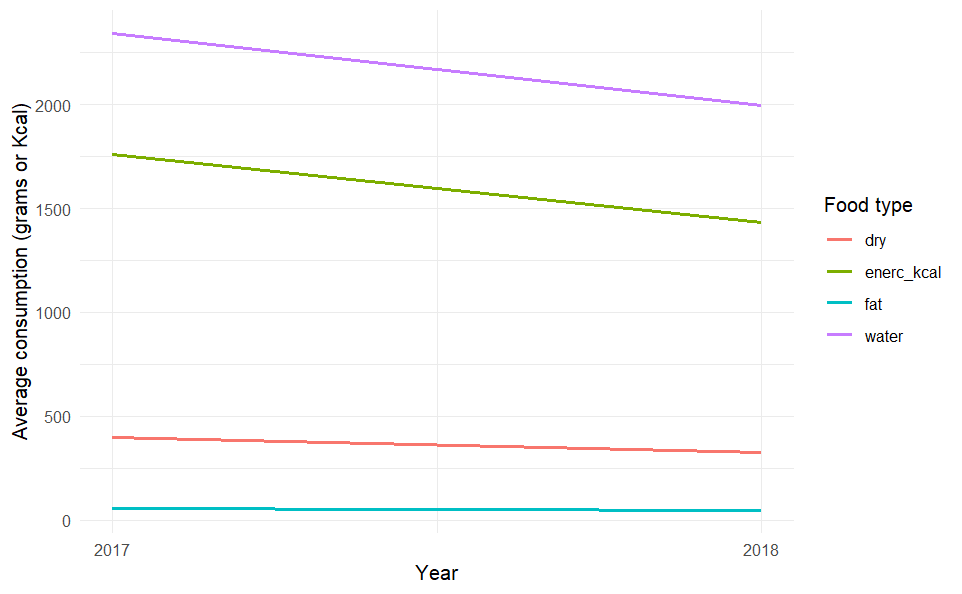
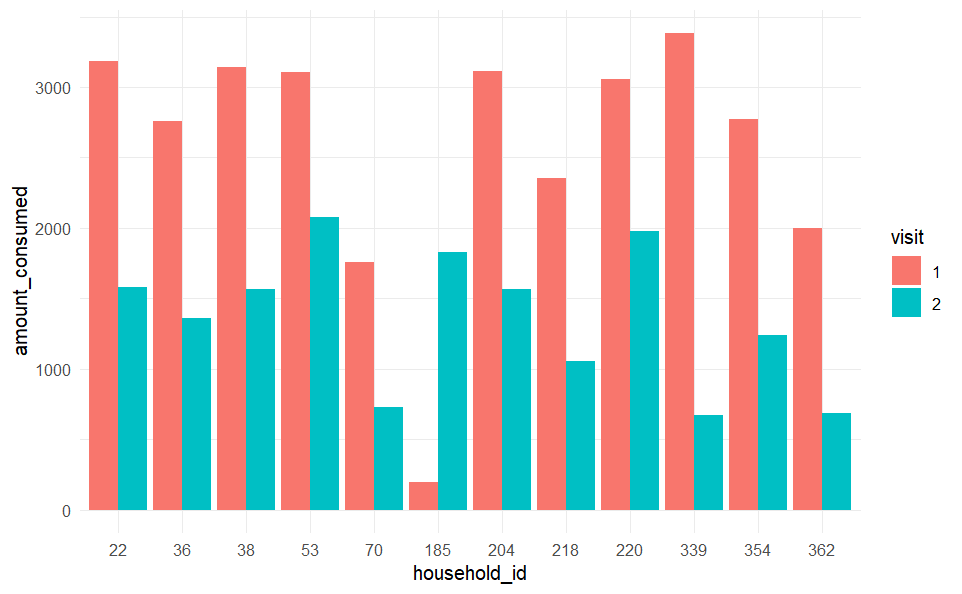

# Introduction

```{r include = FALSE}
knitr::opts_chunk$set(echo = FALSE)
```

Welcome!

In this workshop, we will continue practice cleaning datasets. It is a hands-on approach to using the {dplyr} functions you're already familiar with: `select()`, `filter()`, `mutate()` `case_when()`, `group_by()` `summarize()`, `pivot_wider()`, `pivot_longer()`. These have all been covered in the "Data Wrangling" prework for the past few weeks.

This week's lesson notes have been linked below. They can be very helpful for completing the exercise, so feel free to refer to them during the workshop!

-   [Pivoting Data](https://the-graph-courses.github.io/data_untangled_wp/lessons/ls07_pivoting.html)

-   [Advanced Pivoting](https://the-graph-courses.github.io/data_untangled_wp/lessons/ls08_advanced_pivoting.html)

------------------------------------------------------------------------

# Set Up for the Exercise

1.  **First download the repo to your local computer.** To get started, you should download, unzip, and look through the assignment folder.

2.  **Open the** **RStudio Project** by clicking on the relevant *.Rproj* file in the unzipped workshop folder. Make sure you have opened week_07_workshop.Rproj in RStudio by looking at the name of your RStudio window, or in the upper right corner of your screen.

3.  **Open the assignment Rmd.** Navigate to the Files tab in RStudio and open the "rmd" folder. You will be working in the file called "week_07_exercise.Rmd". This Rmd contains both the instructions and the workshop assignment in one file.

4.  **Complete the assignment.** Work through the steps in "week_07_exercise.Rmd". Replace every instance of `"WRITE_YOUR_CODE_HERE"` with your answers. The assignment should be submitted individually, but you are encouraged to brainstorm with partners. Though you are allowed to work with group members, *it is important that all the code you submit has been typed yourself*.

------------------------------------------------------------------------

# Demo Tutorial: Practicing Pivots with Simple Data

This tutorial demonstrates the use of `pivot_longer()` from the `tidyr` package, focusing on `names_to` and `names_sep` arguments. We'll work with a dummy dataset, `growth_stats`, representing measurements of children's growth over two years.

## Creating a Dummy Dataset

We start by creating the `growth_stats` dataset:

```{r}
growth_stats <- 
  tibble::tribble(
    ~child,~yr1_head,~yr2_head,~yr1_neck,~yr2_neck,~yr1_hip,~yr2_hip,
       "a",       45,       48,       23,       24,      51,      52,
       "b",       48,       50,       24,       26,      52,      52,
       "c",       50,       52,       24,       27,      53,      54
  )

growth_stats
```

## Pivot from Wide to Long

Using `pivot_longer()` to transition from wide to long format, we specify `names_to` with a new variable name and `.value` to split the column names:

```{r}
growth_stats %>%
     pivot_longer(cols = 2:7,
                   names_to = c("year", ".value"),
                   names_sep = "_")
```

**Parsing Numbers**: We can extract the year from the column names and convert it to a numeric variable.

```{r}
growth_stats_long <- 
growth_stats %>%
     pivot_longer(cols = 2:7,
                   names_to = c("year", ".value"),
                   names_sep = "_") %>% 
  mutate(year = parse_number(year))
```

## Visualizing Growth by Year

We can now visualize growth trends by year, focusing on one measurement (e.g., head circumference) at a time:

```{r}
growth_stats_long %>% 
  ggplot(aes(x = year,
             y = neck,
             color = child)) +
  geom_line()
```

-   **Limitation**: This method limits us to visualizing one column at a time: head, neck, or hip.

## Extended Long Format for Versatile Analysis

To analyze all measurements together, we pivot longer to include body part types in our data:

```{r}
growth_stats %>%
     pivot_longer(cols = 2:7,
                   names_to = c("year", "body_part"),
                   names_sep = "_") %>% 
  mutate(year = parse_number(year))
```

In this code chunk, the critical difference from the previous pivoting code lies in the use of the `names_to` argument with the combination of `"year"` and `"body_part"`. This splits the original wide-format column names into TWO separate variables: one for the year of the measurement and one for the body part being measured. Instead of 3 separate columns for each body part, they are all in one:

| child | year | body_part | value |
|-------|------|-----------|-------|
| a     | 1    | head      | 45    |
| a     | 2    | head      | 48    |
| a     | 1    | neck      | 23    |
| a     | 2    | neck      | 24    |
| a     | 1    | hip       | 51    |
| a     | 2    | hip       | 52    |
| b     | 1    | head      | 48    |
| b     | 2    | head      | 50    |
| b     | 1    | neck      | 24    |
| b     | 2    | neck      | 26    |

This results in a long-format dataset where each row represents a single measurement for a specific body part in a given year. This structure makes the data much more versatile for visualization and other data manipulation tasks.

We can use the `values_to` argument to give the last column a more descriptive name:

```{r}
growth_stats %>%
     pivot_longer(cols = 2:7,
                   names_to = c("year", "body_part"),
                   names_sep = "_",
                  # VALUES TO A NAMED COLUMN
                   values_to = "circumference_cm") %>% 
  mutate(year = parse_number(year))
```

```{r}
# Save final long data frame
growth_stats_longer <- 
  growth_stats %>%
     pivot_longer(cols = 2:7,
                   names_to = c("year", "body_part"),
                   names_sep = "_",
                   values_to = "circumference_cm") %>% 
  mutate(year = parse_number(year))
```

Now, we can compare all measurements across years in a single graph.

-   **Example plot 1: Line Type by Body Part**: Differentiate measurements using line types.

```{r}
growth_stats_longer %>% 
  ggplot(aes(x = year,
             y = circumference_cm,
             color = child,
             linetype = body_part)) +
  geom_line()
```

-   **Example plot 2: Faceting by Body Part or Child**: Create separate plots for each body part or child for detailed analysis.

```{r}
growth_stats_longer %>% 
  ggplot(aes(x = year,
             y = circumference_cm,
             color = child)) +
  geom_line() +
  facet_wrap(~body_part)
```

```{r}
growth_stats_longer %>% 
  ggplot(aes(x = year,
             y = circumference_cm,
             color = body_part)) +
  geom_line() +
  facet_wrap(~child)
```

-   **Example plot 3: Filtering for Specific Insights**: Filter out specific measurements for targeted analysis.

```{r}
growth_stats_longer %>% 
  filter(body_part != "neck") %>% 
  ggplot(aes(x = year,
             y = circumference_cm,
             color = child)) +
  geom_line() +
  facet_wrap(~body_part)
```

In this tutorial, we've demonstrated how `pivot_longer()` can transform and enrich our data analysis capabilities. With strategic use of `names_to` and `names_sep`, alongside thoughtful visualization, we can uncover growth patterns across multiple variables.

------------------------------------------------------------------------

# Data: Diet Diversity in Vietnam

To get started, **load in the needed packages**: `{tidyverse}`, `{here}`, and `{esquisse}`.

```{r}
"WRITE_YOUR_CODE_HERE"
```

Now, **read the dataset into R**. Remember to use the `here()` function to allow your Rmd to use project-relative paths.

```{r}
# Import dataset
diet_wide <- "WRITE_YOUR_CODE_HERE"

# Preview of the data frame
diet_wide
```

**Checkpoint**: The data frame you import should have 61 rows and 9 columns.

This subset of the original data contains information on 61 households. Each household was visited twice, and the following data was recorded:

-   Amount of dry content consumed from ingredient/food (g)

-   Amount of water content consumed from ingredient/food (g)

-   Amount of energy consumed from ingredient/food (Kcal)

-   Amount of lipid content consumed from ingredient/food (g)

For each of these measures, there are 2 corresponding columns in the dataset. Measures from the first visit are denoted with a `_1` suffix in the column name, and measures from the second visit are denoted with a `_2` suffix.

Keep in mind that the raw dataset is in a WIDE format. We need to pivot to LONG format in order to make visualizations, as demonstrated with the dummy data above.

------------------------------------------------------------------------

# Pivoting the Data

Although basic data analysis tasks such as finding the mean, etc. are possible on wide format datasets, the code is often longer and involves more tedious manipulation steps.

Long format datasets are optimal for a majority of data analysis tasks.

**YOUR GOAL**: manipulate the `diet_wide` data frame into a long format, where the first few rows look like this:

| household_id | food_type  | visit | amount_consumed |
|--------------|------------|-------|-----------------|
| 348          | enerc_kcal | 1     | 2268.140795     |
| 348          | enerc_kcal | 2     | 1385.754679     |
| 348          | dry        | 1     | 547.531613      |
| 348          | dry        | 2     | 280.751365      |
| 348          | water      | 1     | 4219.325686     |
| 348          | water      | 2     | 1996.918553     |
| 348          | fat        | 1     | 78.404239       |
| 348          | fat        | 2     | 67.725305       |

**Hint**: Start by identifying a unique separator in the wide data frame which you can use for `names_sep`. Then use `names_to` and `values_to` for assigning the correct column names. Refer to the demo section above for example code!

```{r}
diet_long <- "WRITE_YOUR_CODE_HERE"

# Print and view data frame
diet_long
```

**Checkpoint**: `diet_long` should have 488 rows and 4 columns.

The long format dataset allows us to make visualizations that were not easily possible with the wide data. For example, we can make a column chart like this:

```{r}
# Example plot
ggplot(diet_long) +
  aes(x = visit, y = amount_consumed, fill = food_type) +
  geom_col() +
  theme_minimal() 
## If you have trouble running this code, make sure your data frame and columns are named as per the instructions.
```

------------------------------------------------------------------------

# More Practice Using `{dplyr}` Verbs!

Each of the households in the data were visited twice: visit one was in 2017, and visit 2 was in 2018. Use an appropriate {dplyr} function to create a new column called "year", and assign values 2017 or 2018, based on the visit number.

```{r}
diet_long_clean <- "WRITE_YOUR_CODE_HERE"

# Print and view data frame
diet_long_clean
```

Next, use nested grouping to create a summary table that calculates the mean amount consumed for each food type and each year.

```{r}
summary_diet <- "WRITE_YOUR_CODE_HERE"

# Print and view summary data frame
summary_diet
```

**Checkpoint**: The summary table should have 8 rows and 3 columns. Don't forget to ungroup your data after summarizing to avoid future errors!

------------------------------------------------------------------------

# Visualize Data with {esquisse}

Using `esquisse`, plot a line graph comparing how mean consumption for each food type changes between 2017 and 2018.

**Hint**: A line graph requires two numerical variables for the x and y axes. You can separate the four food types by color. You final plot may look like something like this:



```{r}
# esquisser(summary_diet)
"WRITE_YOUR_CODE_HERE"
```

------------------------------------------------------------------------

# Save Outputs

Finally, save your final data frame and plot in the correct files formats in an "outputs" folder.

```{r}
"WRITE_YOUR_CODE_HERE"
```

------------------------------------------------------------------------

# Wrap Up

That's it for this assignment! We will choose 2-3 people to present your work during the workshop. If you would like to share your results with the class, please let an instructor know.

The group representative should prepare to screenshare and give a short (3-4 sentence) presentation.

Choose and highlight one aspect of the workshop that would be helpful and interesting to the class. For example, you can choose a question that your group found especially tricky, and explain how you found the solution. Or you can display one of your plots, and share some tips for additional customization.

------------------------------------------------------------------------

# Submission: Upload Rmd file

Once you have finished the tasks above, you should save your answers and upload your assignment Rmd on the workshop webpage. You should upload just one Rmd file with your answers (do not upload the knitted HTML or a zipped folder). Make sure to include your name in the YAML header at the top of the script.

The due date for the assignment is **Friday, August 23rd at 23:59 PM GMT.**

------------------------------------------------------------------------

# Bonus: Challenge Question (Optional)

Finished early? Try this challenge exercise.

1.  Identify the 12 households that had a difference of over 1000 kilocalories between their visit 1 and visit 2 measurements for energy intake (`enerc_kcal`).

    You can identify these households using either using the long or wide dataset. If you choose to use the long format dataset, you may need to use the `diff()` function from `{dplyr}`.

2.  Make a graph comparing the energy intake of these 12 households for visit 1 vs visit 2 using `esquisse`. For example, you could create a grouped bar chart like this:

    

    For such a plot, it will be easier to use the long format dataset.
